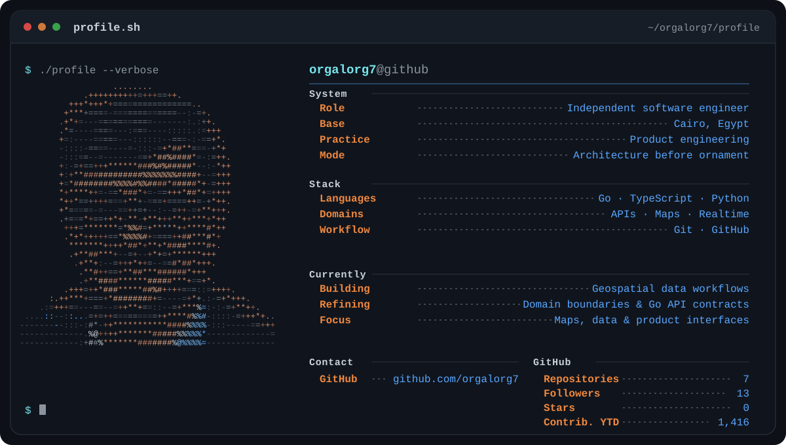

<!-- Generated from profile.config.json by scripts/update-profile.mjs. -->
<picture>
  <source media="(max-width: 640px)" srcset="./assets/profile-terminal-mobile.svg">
  
</picture>

> I design dependable backends, thoughtful interfaces, and geospatial systems.

## Core stack

| Area | Working set |
|:--|:--|
| Languages | Go · TypeScript · Python |
| Domains | APIs · Maps · Realtime |
| Workflow | Git · GitHub |

## Connect

[GitHub](https://github.com/orgalorg7)
