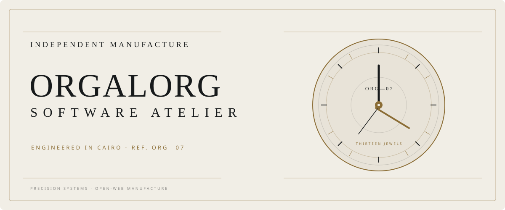
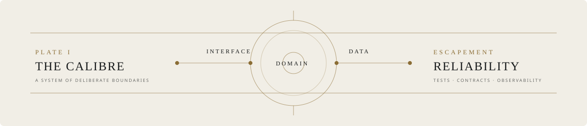

<p align="center">
  <picture>
    <source media="(prefers-color-scheme: dark)" srcset="./assets/masthead-dark.svg">
    <source media="(prefers-color-scheme: light)" srcset="./assets/masthead-light.svg">
    
  </picture>
</p>

<p align="center">
  <sub>INDEPENDENT SOFTWARE ENGINEER · CAIRO, EGYPT</sub>
</p>

<h1 align="center">Software, engineered like a movement.</h1>

<p align="center">
  I design dependable backends, thoughtful interfaces, and geospatial systems.<br>
  Every component has a purpose. Every boundary earns its place.
</p>

<br>

<table>
  <tr>
    <td width="25%"><sub>DISCIPLINE</sub><br><strong>Product engineering</strong></td>
    <td width="25%"><sub>CALIBRE</sub><br><strong>Go · TypeScript · Python</strong></td>
    <td width="25%"><sub>COMPLICATIONS</sub><br><strong>APIs · Maps · Realtime</strong></td>
    <td width="25%"><sub>WORKSHOP</sub><br><strong>Cairo · Egypt</strong></td>
  </tr>
</table>

<br>

<p align="center">
  <picture>
    <source media="(prefers-color-scheme: dark)" srcset="./assets/calibre-dark.svg">
    <source media="(prefers-color-scheme: light)" srcset="./assets/calibre-light.svg">
    
  </picture>
</p>

<br>

## Current collection

### [GeoFlow](https://github.com/orgalorg7/Geoflow) <sub>— REF. GF-01</sub>

A no-code geospatial analysis studio: compose directed workflows, work with satellite imagery, and turn raster data into useful maps. Built with Next.js, FastAPI, PostGIS, Celery, and MapLibre.

`GEOSPATIAL` &nbsp; `WORKFLOW ENGINE` &nbsp; `RASTER PROCESSING`

---

### [Home Food Delivery](https://github.com/averageSadGhost/hfd-backend) <sub>— REF. HFD-13</sub>

A contract-first marketplace backend for chefs, clients, and couriers. Thirteen bounded modules, auditable money flows, realtime communication, and a deliberate path from modular monolith to services.

`GO` &nbsp; `OPENAPI` &nbsp; `POSTGRESQL` &nbsp; `REDIS`

<br>

## The atelier

```text
01  Architecture before ornament
02  Explicit contracts over invisible assumptions
03  Small, precise parts composed into durable systems
04  Interfaces that make complex work feel calm
```

<br>

## On the bench

- Advancing GeoFlow's satellite-data and background-processing pipeline
- Building robust domain boundaries and API contracts in Go
- Refining product interfaces where maps, data, and decisions meet

<br>

<p align="center">
  <a href="https://github.com/orgalorg7">VISIT THE ATELIER</a>
  &nbsp;&nbsp;·&nbsp;&nbsp;
  <a href="https://github.com/orgalorg7?tab=repositories">VIEW THE ARCHIVE</a>
</p>

<br>

<p align="center">
  <picture>
    <source media="(prefers-color-scheme: dark)" srcset="./assets/signature-dark.svg">
    <source media="(prefers-color-scheme: light)" srcset="./assets/signature-light.svg">
    
  </picture>
</p>
