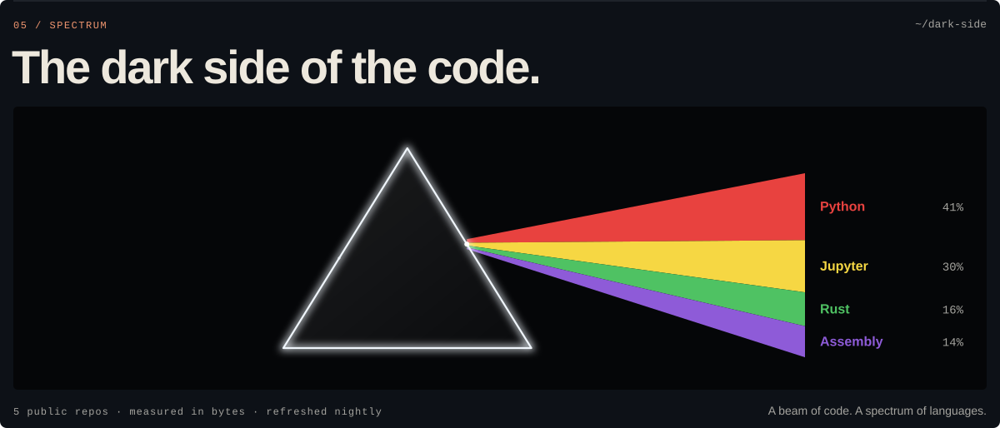

<!-- Generated from profile.config.json by scripts/update-profile.mjs. -->
<picture>
  <source media="(max-width: 640px)" srcset="./assets/profile-terminal-mobile.svg">
  
</picture>

<picture>
  <source media="(max-width: 640px)" srcset="./assets/engineering-stack-mobile.svg">
  
</picture>

<picture>
  <source media="(max-width: 640px)" srcset="./assets/language-prism-mobile.svg">
  
</picture>

<picture>
  <source media="(max-width: 640px)" srcset="./assets/profile-notes-mobile.svg">
  
</picture>

<picture>
  <source media="(max-width: 640px)" srcset="./assets/favorites-mobile.svg">
  
</picture>

<a href="https://www.pinkfloyd.com/albums/the-wall/">Album ↗</a> &nbsp; · &nbsp; <a href="https://en.wikipedia.org/wiki/Epitaph_(song)">Song ↗</a> &nbsp; · &nbsp; <a href="https://en.wikipedia.org/wiki/Downfall_(2004_film)">Film ↗</a>

<a href="https://github.com/orgalorg7">
<picture>
  <source media="(max-width: 640px)" srcset="./assets/profile-connect-mobile.svg">
  
</picture>
</a>
